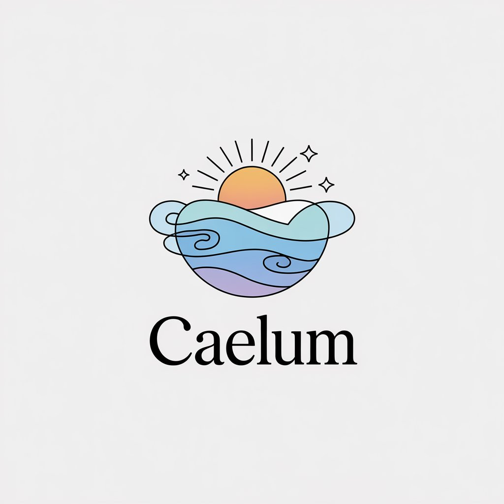

# Caelum



Caelum es una aplicación de pronóstico del tiempo elegante y detallada, desarrollada con Flutter e inspirada en la aplicación de clima de iOS. Ofrece pronósticos meteorológicos en tiempo real con un diseño visualmente atractivo y una interfaz de usuario intuitiva.

## Características

- **Pronóstico en tiempo real**: Obtén información meteorológica actualizada para tu ubicación actual.
- **Pronóstico por horas**: Visualiza el pronóstico del tiempo por horas con un gráfico interactivo al estilo Xiaomi.
- **Pronóstico de 7 días**: Planifica tu semana con el pronóstico detallado para los próximos 7 días.
- **Datos detallados**: Información sobre temperatura, humedad, velocidad del viento y sensación térmica.
- **Indicadores de amanecer y atardecer**: Visualiza las horas exactas del amanecer y atardecer en el pronóstico por horas.
- **Fondos dinámicos**: Imágenes de fondo que cambian según las condiciones meteorológicas y la hora del día.
- **Interfaz adaptativa**: Diseño que se ajusta entre modo expandido y colapsado al hacer scroll.
- **Efecto de cristal (glassmorphism)**: Elementos de interfaz con efecto de desenfoque y transparencia.

## Tecnologías utilizadas

- **Flutter**: Framework para el desarrollo de aplicaciones multiplataforma.
- **Provider**: Gestión de estado para mantener actualizada la interfaz de usuario.
- **Geolocator**: Obtención de la ubicación actual del dispositivo.
- **HTTP**: Comunicación con la API de OpenWeather.
- **Intl**: Internacionalización y formateo de fechas.
- **Flutter dotenv**: Manejo seguro de variables de entorno (API keys).
- **CupertinoWidgets**: Componentes que siguen el diseño de iOS.

## Requisitos previos

- Flutter SDK (versión 3.2.3 o superior)
- Dart SDK (incluido con Flutter)
- Una cuenta en [OpenWeather](https://openweathermap.org/) para obtener una API key

## Configuración del proyecto

1. Clona este repositorio:
   ```
   git clone https://github.com/tuusuario/caelum.git
   ```

2. Navega al directorio del proyecto:
   ```
   cd caelum
   ```

3. Instala las dependencias:
   ```
   flutter pub get
   ```

4. Crea un archivo `.env` en la raíz del proyecto con tu API key de OpenWeather:
   ```
   OPENWEATHER_API_KEY=tu_api_key_aquí
   ```

5. Ejecuta la aplicación:
   ```
   flutter run
   ```

## Estructura del proyecto

- **lib/main.dart**: Punto de entrada de la aplicación y configuración inicial.
- **lib/screens/**: Pantallas principales de la aplicación.
- **lib/widgets/**: Componentes reutilizables de la interfaz.
- **lib/providers/**: Gestores de estado y lógica de negocio.
- **lib/utils/**: Utilidades y funciones auxiliares.
- **assets/images/weather_backgrounds/**: Imágenes de fondo para diferentes condiciones meteorológicas.

## Contribución

Las contribuciones son bienvenidas. Si deseas contribuir a este proyecto:

1. Haz un fork del repositorio
2. Crea una rama para tu funcionalidad (`git checkout -b feature/nueva-funcionalidad`)
3. Realiza tus cambios y haz commit (`git commit -m 'Añadir nueva funcionalidad'`)
4. Sube los cambios a tu fork (`git push origin feature/nueva-funcionalidad`)
5. Abre un Pull Request

## Licencia

Este proyecto está licenciado bajo la Licencia MIT - consulta el archivo LICENSE para más detalles.

## Capturas de pantalla

[Aquí puedes incluir capturas de pantalla de la aplicación]

## Créditos

- Imágenes de fondo: Unsplash
- Datos meteorológicos: OpenWeather API
